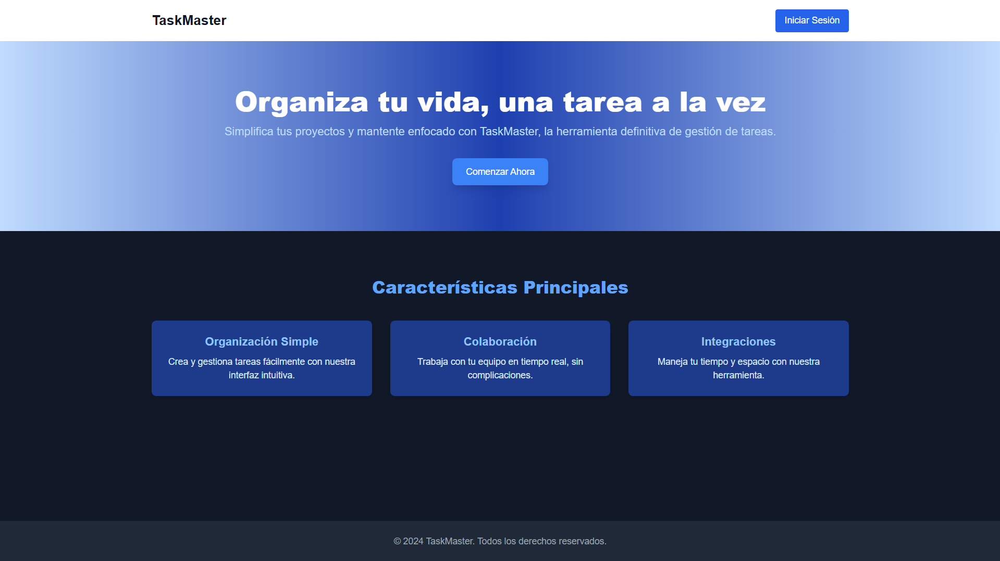

# 📋 Gestión de Tareas - Rony Banol

¡Bienvenido a **Gestión de Tareas**! 🎉 Esta es una aplicación web que permite la gestión eficiente de proyectos y tareas. Puedes iniciar sesión como Administrador o Usuario, dependiendo de tus permisos, y disfrutar de un entorno organizado para manejar tus actividades.

---

## 🚀 Despliegue

Accede a la aplicación en el siguiente enlace:  
🔗 [Gestión de Tareas](https://rony-banol-gestion-de-tareas.vercel.app/)

---

## 🎨 Vista previa de la aplicación

---

## 👤 Usuarios de prueba

### **Administrador**

- **Correo:** `admin1@admin.com`
- **Contraseña:** `admin`

### **Usuario**

- **Correo:** `user1@user.com`
- **Contraseña:** `user`

---

## 🛠️ Cómo iniciar el proyecto localmente

### **1. Clonar el repositorio**

---

bash
git clone [https://github.com/Rony-San/Rony-Banol-Gestion-de-tareas.git](https://github.com/20242-Ingenieria-Web-Udea-MJ/Rony-Banol-Gestion-de-tareas)
cd Rony-Banol-Gestion-de-tareas

### 2. Instalar dependencias

Usamos Yarn como gestor de paquetes. Asegúrate de tenerlo instalado previamente:
bash
Copy code
yarn install

### 3. Configurar variables de entorno

Crea un archivo .env.local en el directorio raíz y añade las siguientes variables necesarias para conectarte al backend GraphQL:

env
Copy code
DATABASE_URL=https:/tu-base-de-datos-postgres

### 4. Iniciar el servidor de desarrollo

Ejecuta el siguiente comando para iniciar el servidor localmente:

bash
Copy code
yarn dev
La aplicación estará disponible en: http://localhost:3000

---

## 🧰 Herramientas utilizadas

Frontend: React + Next.js
GraphQL: Apollo Client
Estilos: Tailwind CSS
UI: Material-UI (MUI)
Notificaciones: react-toastify
Backend: GraphQL (configurado externamente)
Despliegue: Vercel

---

## 💻 Funcionalidades principales

Inicio de sesión: Diferenciado entre Administradores y Usuarios.
Gestión de proyectos: Crear, editar y listar proyectos.
Gestión de tareas: Asignar tareas, cambiar estado y ver detalles.
Responsividad: Optimizado para dispositivos móviles y de escritorio.
Manejo de errores: Notificaciones claras mediante Toastify.
Actualización en tiempo real: Integración con Apollo Cache.

---

## 📂 Estructura del proyecto

plaintext
Copy code
src/
├── components/ # Componentes reutilizables
├── molecules/ # Componentes más complejos (formularios, modales)
├── pages/ # Páginas de Next.js
├── types/ # Definición de tipos TypeScript
├── utils/ # Funciones auxiliares y configuración de GraphQL
├── styles/ # Configuración de estilos
# 20242-Ingenieria-Web-Udea-MJ-Rony-Banol-Gestion-de-tareas
